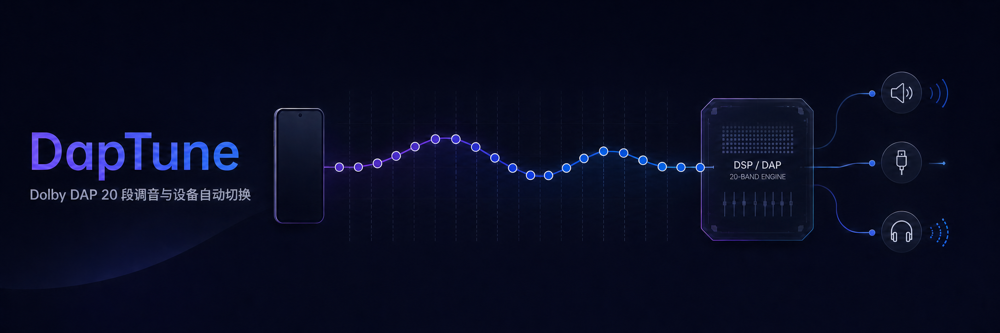

# DapTune

[简体中文](README.md) · [Installation](docs/installation.md) ·
[Compatibility](docs/compatibility.md) · [DapTune JSON](docs/daptune-json-format.md) ·
[Import formats](docs/import-formats.md) · [Architecture](docs/architecture.md) ·
[Troubleshooting](docs/troubleshooting.md)

DapTune is a local Android tuning utility for systems that already integrate Xiaomi Dolby DAP.
It manages a fixed 20-band curve, writes parameter 110 (`GraphicEqualizerBandGains`) to the
existing vendor DSP through the global `AudioEffect` session 0, and can apply a selected profile
when the active playback device changes.

DapTune does not process or forward PCM, capture audio, replace Android audio routing, or enable,
circumvent, or emulate Dolby. It writes only parameter 110 on a recognized DAP and leaves spatial
audio, volume leveling, and every other Dolby parameter untouched.

> [!WARNING]
> DapTune is an independent experimental project with no affiliation to Dolby Laboratories,
> Xiaomi, or related brands. It controls a global vendor effect through private Android and
> firmware interfaces. System updates, player output modes, and USB or passthrough routes can
> change the audible result. After first installation, every system update, and every new output
> path, verify an obvious but safe test curve at low volume. A command being accepted does not
> prove that the current audio path passes through DAP.

## What it does

### Curves and profiles

- Edits the fixed 20 Dolby DAP center frequencies and stores every gain as signed Q4 (1/16 dB);
- enforces a `+10 dB` boost ceiling without an artificial attenuation floor, while the graph and
  gain axis expand for deeper cuts;
- provides a large interactive graph and 20 tactile sliders with point selection, band locking,
  and a 0.5 dB interaction step;
- saves, copies, overwrites, renames, and deletes custom profiles, with custom profiles listed
  first;
- includes Flat, Warm, Powerful, Loudness, Vocal, Bright, and Soft starting points.

### Import and curve processing

- Imports lossless DapTune JSON, Wavelet/AutoEq `GraphicEQ`, the supported
  Equalizer APO/AutoEq parametric subset, and CSV, TSV, or text frequency-gain tables;
- searches AutoEq's official recommended results by headphone model and converts the selected
  standard `GraphicEQ` into a saved 20-band custom profile;
- supports automatic detection and an explicit source selector; an explicit choice never silently
  falls through to another parser;
- provides peak and mean normalization, smoothing, uniform shift, scaling, and a configurable hard
  upper threshold;
- converts non-native curves through deterministic log-frequency interpolation or a 48 kHz biquad
  magnitude response before the final 20-band Q4 quantization.

### Per-device automation

- Distinguishes the phone speaker, generic wired output, individual Bluetooth or LE Audio devices,
  USB, and HDMI;
- resolves profiles in the order exact device rule, default rule, then built-in Flat;
- updates the current device rule when its profile is changed, without forcing navigation back to
  the editor;
- uses an event-driven foreground service with no audio polling, wake lock, or second resident
  process;
- can restore the service after boot or app replacement only when the user has enabled automation;
- records route, profile, trigger, write result, and verification level in a dedicated clearable
  log.
- provides an About screen with manual GitHub release checks and an enabled-by-default automatic
  check limited to once every 24 hours.

### Write safety

- Checks the effect descriptor, control ownership, effect and DAP switches, profile count, and
  readback capability before writing;
- writes every profile on Xiaomi proxy `DAP`, reads all 20 values back, and rolls everything back
  on a mismatch;
- handles direct `DAP_offload` as setter-only and never mistakes a zero-filled read buffer for a
  real curve;
- serializes write transactions and always releases `AudioEffect`; invalid critical state causes
  a refusal instead of a best-effort modification.

## Runtime boundary

DapTune ends at selecting one 20-band curve and handing it to the existing system DAP. It does not:

- implement an in-app software equalizer, convolver, limiter, or any other PCM DSP;
- control the player, audio focus, sample rate, output device, or system Dolby master switch;
- guarantee that every player, USB DAC, exclusive/direct/offload mode, or low-latency path traverses
  the global DAP;
- create a Dolby DSP on devices without the target implementation;
- use root, LSPosed, Shizuku, or a persistent ADB shell to bypass platform permissions.

`tools/magisk/daptune-usb-dsp-offload` is a separate experimental utility for one validated Xiaomi
`turner` route. It is not a dependency of the app and must not be installed on other products.

## Compatibility at a glance

An Android version, phone brand, or a visible “Dolby Atmos” settings page does not establish
compatibility by itself. DapTune does not use a device-model allowlist; it verifies the runtime
descriptor and protocol.

| Scope | Status | Verification semantics |
|---|---|---|
| Xiaomi proxy `DAP` type `fa81dbde-588b-11ed-9b6a-0242ac120002` | Supported | Reads all 20 values from every profile; rolls back on mismatch |
| Direct `DAP_offload` type `46d279d9-9be7-453d-9d7c-ef937f675587` | Supported | Setter-only; rechecks ownership, switches, and profile state |
| Speaker, Bluetooth, or wired output routed through global DAP | Conditional | Requires an audible A/B with the same player, level, and route |
| Independent USB ALSA, player direct/offload, exclusive, or low-latency output | Not guaranteed | The path may bypass global DAP completely |
| Android standard EQ or another implementation | Unsupported | A descriptor mismatch is rejected |

## System requirements

- Android 11 (API 30) or newer;
- implementation UUID `9d4921da-8225-4f29-aefa-39537a04bcaa`;
- the system Dolby effect and DAP already enabled, with effect control available to the app;
- an active media path that actually traverses that global DAP.

The main app needs no root, LSPosed, Shizuku, or persistent ADB shell on validated firmware. See
[Compatibility](docs/compatibility.md) for exact identifiers, profiles, readback behavior, and
playback-route limitations.

## Installation

### Official builds

1. Download `DapTune-vX.Y.Z.apk` and its matching `.sha256` from
   [Releases](https://github.com/silverpoetry/DapTune/releases);
2. verify SHA-256 and do not install third-party repackages, temporary Actions artifacts, or an
   `optimized` test build;
3. leave the system Dolby effect enabled and perform the low-volume verification below;
4. grant Nearby devices on first launch; grant notifications and configure the device's background
   policy only if automation requires them.

~~~powershell
Get-FileHash .\DapTune-vX.Y.Z.apk -Algorithm SHA256
Get-Content .\DapTune-vX.Y.Z.apk.sha256
~~~

An empty Releases page means that no officially signed APK has been published yet. Build from
source in that case; do not treat a local debug-certificate build as an official release. See the
official APK signing certificate SHA-256:
`79:62:1F:C9:4C:0C:56:C8:10:8C:BE:C8:32:28:81:7C:D0:6A:E6:1B:05:26:92:53:C3:2D:8D:D2:60:89:4E:F0`.
See the [installation guide](docs/installation.md) for source builds, upgrades, signature
mismatches, and uninstallation, and the
[release-signing document](docs/release-signing.md#正式发布证书) for the public certificate.

## First run

1. Enable Dolby Atmos in system settings and confirm that the system switch itself produces an
   audible difference;
2. open DapTune and grant Nearby devices; this is a prerequisite for accurate Bluetooth identity;
3. select Flat in Tune and apply it;
4. at low volume, temporarily make an obvious midrange cut and compare it with the same player,
   level, and output;
5. distinguish “curve verified by readback” from “write command accepted,” then restore the target
   curve;
6. import or save named curves from Profiles;
7. assign the default and per-device rules in Automation, then enable automatic switching;
8. enable restore-after-reboot only if desired, and allow autostart, background operation, or an
   unrestricted battery policy where the firmware requires it;
9. switch outputs and inspect the log for the detected route, selected profile, and write result.

### Result semantics

| Result | Meaning | What it proves |
|---|---|---|
| Curve verified by readback | Every Q4 value in every proxy-DAP profile matches the target | Parameter storage and the write agree |
| Write command accepted | The setter-only call succeeded and critical DAP state remained valid | The system accepted the command, but individual values cannot be read back |
| Apply failed / rolled back | State validation, writing, saving, or readback failed | The target curve must not be considered applied |

No result alone proves that the current player's PCM traversed the DAP. The target route still
requires an audible check.

## Automation and background behavior

Automation runs only after the user explicitly enables it. The service first registers route
monitoring, then immediately resolves and applies the current output. An unchanged route and curve
are not written again during the same service lifetime. Exact device rules override the default
profile; deleting a historical device also removes its device record and rule.

On Android 12 and newer, Nearby devices is required before entering the app. A persistent Bluetooth
key is created only when a complete address is uniquely verified against Android's bonded-device
inventory. An anonymized address, device name, or MediaRouter wrapper ID is never persisted or used
for a device-specific rule. If permission is revoked while the app is running, the UI returns to the
permission gate and automation refuses to guess by name. Granting it again triggers an immediate
route refresh. A single vendor route-API failure is isolated and the listener is re-registered with
a bounded backoff.

“Restore automation after device restart” means that an already enabled automation service is
restored after `BOOT_COMPLETED` or app replacement. It is not the automation master switch and does
not restart a service the user explicitly stopped.

On Android 13 and newer, denying notification permission still allows an AOSP foreground service,
but removes its notification from the drawer. Some vendor background managers may then terminate
the app more aggressively. For reliable long-running automation, allow the low-priority
notification and confirm that the service remains visible under the system's active-app view. See
[Automation and notifications](docs/compatibility.md#自动切换与通知).

## Profiles and import formats

| Source | Supported input | Conversion |
|---|---|---|
| DapTune JSON v1 | Fixed 20-band signed Q4 | Lossless, no resampling |
| GraphicEQ | Common Wavelet/AutoEq `GraphicEQ:` plus global `Preamp:` | Linear interpolation on a log-frequency axis |
| ParametricEQ | `PK/PEQ`, `LS/LSC`, and `HS/HSC` plus global `Preamp:` | 48 kHz biquad magnitude response |
| CSV / TSV / text table | Two frequency-gain columns or recognized headers | Linear interpolation on a log-frequency axis |
| AutoEq online catalog | Headphone models and canonical `GraphicEQ` files from recommended results | Local search, on-demand download, then the same converter |

Independent channels, convolution, Include, Copy, Delay, LoudnessCorrection, and instructions that
cannot be reduced to one 20-band magnitude curve are rejected explicitly rather than ignored. See
[Import formats](docs/import-formats.md) for the full grammar, header precedence, out-of-range
behavior, and positive-gain overflow strategies.

### DapTune JSON v1

The recommended extension is `.daptune.json`. All six members are required and unknown members are
rejected:

~~~json
{
  "format": "com.weich.daptune.profile",
  "version": 1,
  "name": "Flat",
  "band_plan": "dolby-dap-20-v1",
  "frequencies_hz": [
    47, 141, 234, 328, 469, 656, 844, 1031, 1313, 1688,
    2250, 3000, 3750, 4688, 5813, 7125, 9000, 11250, 13875, 19688
  ],
  "gains_q4": [
    0, 0, 0, 0, 0, 0, 0, 0, 0, 0,
    0, 0, 0, 0, 0, 0, 0, 0, 0, 0
  ]
}
~~~

`gains_q4` uses `dB = Q4 / 16`. The maximum value is `160` (`+10 dB`), and there is no
application-level attenuation floor. There is no separate `preamp` field; a global attenuation is
represented by subtracting the same Q4 value from all 20 bands.

- [Normative DapTune JSON v1 specification](docs/daptune-json-format.md)
- [JSON Schema Draft 2020-12](docs/schema/daptune-profile-v1.schema.json)
- [Flat example](examples/profiles/flat.daptune.json)
- [Warm example](examples/profiles/warm.daptune.json)
- [Deep-attenuation example](examples/profiles/deep-attenuation.daptune.json)

## Design boundary

~~~text
File / 20-band editor
        |
        v
EqCurve: 20 signed Q4 Int values ------+
                                       |
Android output-route events            |
        |                              |
        v                              v
PlaybackRouteMonitor -> device rule -> ApplyEqCurve
                                           |
                                           v
                                  DapWriter transaction
                                           |
                                           v
                                  AudioEffect session 0
                                  parameter 110 / all profiles
                                     |                 |
                                     v                 v
                              proxy: read/rollback  offload: setter-only
~~~

The project uses one-way module dependencies and a local-first architecture:

- `core:model` contains immutable curves, profiles, routes, DAP results, and log models;
- `core:eq` owns strict parsing, interpolation, biquad sampling, Q4 quantization, and transforms;
- `domain` defines repository and platform boundaries plus profile-selection and application use
  cases;
- `data` implements Room, DataStore, and repositories;
- `platform:dap` classifies descriptors and implements the private `AudioEffect` bridge and write
  transaction;
- `platform:routing` handles output events, device identity, and privacy-safe stable keys;
- `feature:*` contains Material 3 UI, ViewModels, and the foreground service;
- `app` provides Hilt, Compose navigation, and the application entry point.

Read the [architecture document](docs/architecture.md) and
[architecture decision records](docs/adr) for complete data flow and dependency constraints.

## Privacy and security

- `INTERNET` is used only for official AutoEq content and this project's GitHub Release metadata;
- the manifest declares no microphone, camera, location, or media-read permission;
- the app contains no analytics, advertising, telemetry, remote crash reporting, or upload
  endpoint;
- it never reads, records, caches, or uploads audio;
- raw Bluetooth addresses are not stored; a stable key is derived locally only after the address
  has been verified against Android's bonded-device inventory;
- profiles, rules, device display names, and clearable logs stay in app-private storage, subject to
  the user's Android backup settings;
- report security issues through
  [GitHub Private Vulnerability Reporting](https://github.com/silverpoetry/DapTune/security/advisories/new)
  and never publish device identifiers, complete system dumps, vendor files, or signing material.

See [Privacy](PRIVACY.md) and [Security](SECURITY.md).

## Build and verify

Use Node.js 20 or newer, JDK 17, Android SDK Platform 36, and the committed Gradle Wrapper:

~~~powershell
npx --yes markdownlint-cli2@0.18.1 "*.md" "docs/**/*.md" "tools/**/*.md" ".github/**/*.md"
node .\tools\validate-docs.mjs
node .\tools\validate-profile-contract.mjs
.\gradlew.bat --no-daemon testDebugUnitTest lintRelease :app:assembleRelease
~~~

`release` enables R8 and resource shrinking. Without the complete signing environment, it produces
an unsigned APK for source verification only. `optimized` uses the same optimization with a
`.debug` application ID and the local debug certificate; it is never an official release.

CI checks Markdown and repository links, consistency between the DapTune JSON specification,
Schema, examples, and Kotlin constants, Gradle Wrapper integrity, JVM tests, Android Lint, and the
R8 release build. The `v*` tag workflow checks `versionName`, signs with repository Secrets,
verifies with `apksigner`, and publishes both the APK and SHA-256. See
[Release signing and artifact verification](docs/release-signing.md).

## Troubleshooting shortcuts

- **No compatible Dolby DAP found:** check the system Dolby state, implementation UUID, and recent
  system updates;
- **applied successfully but sounds identical:** inspect player direct/offload mode, output order,
  and whether the target route bypasses DAP;
- **USB wired audio is unaffected:** the DAC may use an independent ALSA handler that the app cannot
  reroute;
- **automation stops after dismissing Recents:** verify the automation switch, foreground service,
  notification, and vendor background policy;
- **an import fails or produces the wrong curve:** choose the source explicitly and inspect
  unsupported channels, filters, or positive-gain overflow.

The [troubleshooting guide](docs/troubleshooting.md) contains step-by-step diagnostics and the
minimum redacted evidence needed for an issue.

## Documentation

- [Installation, upgrade, and uninstallation](docs/installation.md)
- [Compatibility and known limitations](docs/compatibility.md)
- [DapTune JSON profile format v1](docs/daptune-json-format.md)
- [Common equalizer import formats](docs/import-formats.md)
- [System architecture](docs/architecture.md)
- [Troubleshooting](docs/troubleshooting.md)
- [Release signing and artifact verification](docs/release-signing.md)
- [Architecture decision records](docs/adr)
- [Changelog](CHANGELOG.md)
- [Privacy](PRIVACY.md)
- [Security](SECURITY.md)
- [Contributing](CONTRIBUTING.md)
- [Third-party notices](THIRD_PARTY_NOTICES.md)

## Contributing

Changes to a DAP descriptor, protocol, readback semantics, or route support require reproducible and
redacted device evidence. Format changes must update the decoder, tests, JSON Schema, examples, and
specification together. Do not submit vendor APKs, complete frameworks, real recordings, serial
numbers, Bluetooth addresses, IP addresses, accounts, or signing material. Read
[CONTRIBUTING.md](CONTRIBUTING.md) for the complete requirements.

## License and trademarks

DapTune is licensed under the [Apache License 2.0](LICENSE). Third-party components and licenses are
listed in [THIRD_PARTY_NOTICES.md](THIRD_PARTY_NOTICES.md).

Dolby, Dolby Atmos, Xiaomi, Android, and all other names and marks belong to their respective
owners. References describe compatibility interfaces and test environments only; they do not imply
endorsement, authorization, or affiliation.
